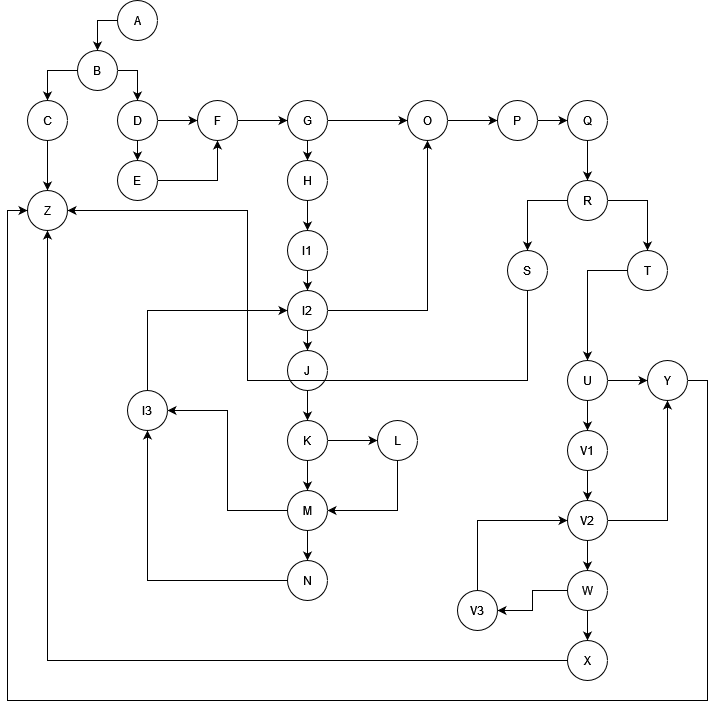
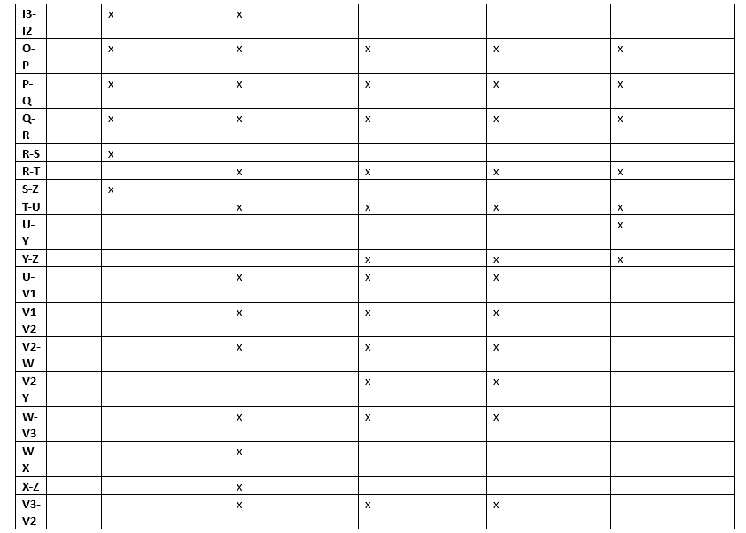
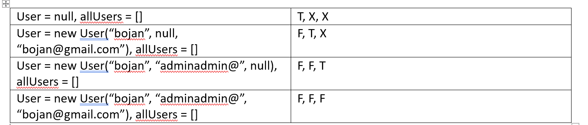

# Bojan Nastovski 173121

# Control Flow Graph

# Cyclomatic Complexity

Treba da se odzemat brojot na jazli od brojot na rebra i da se dodade 2.  
broj na rebra = 39  
broj na jazli = 30  
39 - 30 + 2 = 11  
Ciklomatskata kompleksnost na grafot e 11.

# Every Branch

1.  Celta na prviot test e da se frli isklucok, a so toa da se pominat grankite od prviot if
2.  Celta na vtoriot test e da se izminat grankite vo for ciklucot kade ke se ispolni uslovot deka vo listata ima korisnik so ist username kako i vlezniot korisnik. Potoa da se izleze od programot so return false poradi toa sto lozinkata e pomala od 8 karakteri
3.  Celta e da se izmine onoj if vor for ciklusot koj proveruva dali emailot na vlezniot korisnik e zafaten od drug user, a potoa poradi toa sto pasvordot e validen da se vleze vo dolniot for ciklus no da se izleze kaj return same == 0 so false poradi toa sto ima eden korisnik so ist email
4.  Celta e da se izmine if uslovot kade se proveruva dali vlezniot user nema username i da se postavi negoviot email kako username, potoa poradi toa sto passwordot nema specijalni karakteri da se izmine grankata od V do Y.
5.  Celta e da se dade nevaliden email
6.  Celta e da se dade password koj sodrzi " " vo nego i da se izmine grankata U-Y

# Multiple Condition

Ovde se testira if uslovot so 4 razlicni testovi: (T,X,X), (F,T,X), (F,F,T), (F,F,F). Tuka so Lazy Evaluation se spojuvaat (T,T,T), (T,F,T), (T,T,F), (T,F,F) vo (T,X,X) i (F,T,T), (F,T,F) vo (F,T,X).

## Unit tests
Za sekoj od test primerite dodavam po eden unit test.  
Testot 1 treba da mmi vrati Runtime Exception pa zatoa dodavam assertThrows za toj test.  
Testot 2 treba da mi vrati false, pa zatoa koristam assertFalse.  
Istoto vazi i za ostanatite testovi.
